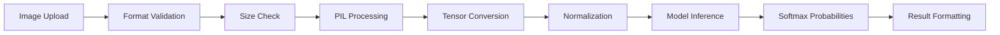

# Concrete Crack Detection System

A production-ready AI-powered web application that automatically detects structural cracks in concrete surfaces using deep learning computer vision. Built with a modern full-stack architecture featuring a FastAPI backend with PyTorch inference and a responsive React frontend.


## 🎯 Project Overview

This application demonstrates advanced computer vision capabilities applied to structural engineering, providing real-time crack detection in concrete surfaces with confidence scoring and detailed analysis. The system combines state-of-the-art deep learning with modern web technologies to deliver a professional-grade inspection tool.

## 🧠 AI Architecture & Model

### Deep Learning Pipeline

The core AI system is built around a **ResNet-18 convolutional neural network**, specifically fine-tuned for binary classification of concrete surface conditions:

- **Architecture**: ResNet-18 with modified final layer (512 → 2 classes)
- **Training**: Custom dataset with transfer learning from ImageNet weights
- **Input Processing**: 227×227 RGB images with ImageNet normalization
- **Output**: Binary classification (Crack/No Crack) with confidence probabilities
- **Optimization**: Dynamic quantization for production inference speed

### Model Performance Features

```python
# Core prediction pipeline
transforms.Compose([
    transforms.Resize((227, 227)),
    transforms.ToTensor(),
    transforms.Normalize(mean=[0.485, 0.456, 0.406], std=[0.229, 0.224, 0.225])
])
```

- **Confidence Scoring**: Softmax probability distribution for prediction certainty
- **Real-time Inference**: Optimized for sub-second processing
- **Robust Preprocessing**: Handles various image formats and lighting conditions
- **Error Handling**: Comprehensive validation and fallback mechanisms

## 🏗️ System Architecture

### Backend (FastAPI + PyTorch)

The backend implements a high-performance inference API with production-ready features:

```python
class CrackDetector:
    def __init__(self):
        self.device = torch.device('cuda' if torch.cuda.is_available() else 'cpu')
        self.model = self._load_model()
        self.transform = self._get_transforms()
```

**Key Components:**
- **FastAPI Framework**: Async request handling with automatic OpenAPI documentation
- **PyTorch Integration**: Direct model loading and inference pipeline
- **CORS Middleware**: Configured for cross-origin requests from frontend
- **File Validation**: Size limits, format checking, and security measures
- **Error Handling**: Structured exception handling with detailed logging
- **Health Monitoring**: Endpoint for system status and model availability

**API Endpoints:**
- `POST /predict` - Main inference endpoint with multipart file upload
- `GET /health` - System health check with model status
- `GET /` - Basic service availability check

### Frontend (Next.js + TypeScript)

Modern React application with enterprise-grade UI/UX patterns:

**Architecture Highlights:**
- **Next.js 14**: App Router with server-side rendering capabilities
- **TypeScript**: Full type safety across components and API interfaces
- **Component Architecture**: Modular design with reusable UI components
- **State Management**: Custom hooks for analysis workflow and API integration
- **Real-time Updates**: Progress tracking and live result display

**Key Components:**

```typescript
interface AnalysisResult {
  prediction: "crack" | "no_crack";
  confidence: number;
  probabilities: {
    crack: number;
    no_crack: number;
  };
}
```

- **ImageUploader**: Drag-and-drop interface with file validation
- **AnalysisResults**: Comprehensive result display with confidence visualization
- **useImageAnalysis**: Custom hook managing API calls and state transitions
- **Theme System**: Dark/light mode with system preference detection

## 🎨 User Experience Design

### Interface Design Philosophy

The application prioritizes professional usability with modern design patterns:

- **Glass Morphism**: Translucent components with backdrop blur effects
- **Progressive Disclosure**: Information revealed based on analysis state
- **Micro-interactions**: Framer Motion animations for smooth transitions
- **Responsive Layout**: Optimized for desktop, tablet, and mobile workflows
- **Accessibility**: WCAG compliant with proper ARIA labels and keyboard navigation

### Analysis Workflow

1. **Image Upload**: Drag-and-drop or click-to-select with instant preview
2. **Processing**: Real-time progress indication with animated loading states
3. **Results Display**: Confidence scoring, probability breakdown, and recommendations
4. **Action Items**: Context-aware suggestions based on detection results

## 🔧 Technology Stack

### Backend Technologies

| Technology | Purpose | Version |
|------------|---------|---------|
| **FastAPI** | Web framework and API server | 0.115.12+ |
| **PyTorch** | Deep learning inference engine | 2.6.0+ |
| **Torchvision** | Computer vision utilities | 0.21.0+ |
| **Pillow** | Image processing and manipulation | 10.4.0+ |
| **Uvicorn** | ASGI server for production deployment | 0.20.0+ |

### Frontend Technologies

| Technology | Purpose | Version |
|------------|---------|---------|
| **Next.js** | React framework with SSR | 14.2.0+ |
| **TypeScript** | Type-safe JavaScript development | 5.3.0+ |
| **Tailwind CSS** | Utility-first styling framework | 3.4.0+ |
| **Framer Motion** | Animation and gesture library | 11.0.0+ |
| **Radix UI** | Accessible component primitives | Various |
| **Axios** | HTTP client for API communication | 1.6.0+ |
| **React Dropzone** | File upload with drag-and-drop | 14.2.3+ |

### Development & Build Tools

- **ESLint**: Code linting and style enforcement
- **PostCSS**: CSS processing and optimization
- **Autoprefixer**: CSS vendor prefix automation
- **TypeScript Compiler**: Type checking and compilation

## 🚀 Setup & Configuration

### Prerequisites

- **Python 3.8+** with pip
- **Node.js 18+** with npm
- **AWS Account** with S3 bucket access

### Environment Setup

1. **Clone the repository:**
   ```bash
   git clone <repository-url>
   cd Concrete-Crack-Detector-CV
   ```

2. **Backend Setup:**
   ```bash
   # Create virtual environment
   python -m venv venv
   source venv/bin/activate  # On Windows: venv\Scripts\activate
   
   # Install dependencies
   pip install -r requirements.txt
   ```

3. **Frontend Setup:**
   ```bash
   npm install
   ```

4. **Environment Configuration:**
   ```bash
   # Copy the environment template
   cp env.template .env
   
   # Edit .env with your AWS credentials
   AWS_ACCESS_KEY_ID=your_access_key
   AWS_SECRET_ACCESS_KEY=your_secret_key
   AWS_REGION=us-east-2
   S3_BUCKET_NAME=your_bucket_name
   S3_MODEL_KEY=resnet18_trained.pth
   ```

### S3 Model Setup

The application now uses AWS S3 for model storage, providing better scalability and repository management:

**Option 1: Upload your trained model to S3**
```bash
# Install AWS CLI
pip install awscli

# Configure AWS credentials
aws configure

# Upload model file
aws s3 cp resnet18_trained.pth s3://your-bucket-name/resnet18_trained.pth
```

**Option 2: Local fallback**
The system will automatically fall back to the local `resnet18_trained.pth` file if S3 access fails.

### Running the Application

1. **Start the Backend:**
   ```bash
   python app.py
   # Server runs on http://localhost:8000
   ```

2. **Start the Frontend (in a new terminal):**
   ```bash
   npm run dev
   # Application runs on http://localhost:3000
   ```

3. **API Documentation:**
   Visit `http://localhost:8000/docs` for interactive API documentation.

### Configuration Options

| Environment Variable | Description | Default |
|---------------------|-------------|---------|
| `AWS_ACCESS_KEY_ID` | AWS access key for S3 | Required |
| `AWS_SECRET_ACCESS_KEY` | AWS secret key for S3 | Required |
| `AWS_REGION` | S3 bucket region | us-east-2 |
| `S3_BUCKET_NAME` | S3 bucket containing model | Required |
| `S3_MODEL_KEY` | Model file path in S3 | resnet18_trained.pth |
| `ALLOWED_ORIGINS` | CORS allowed origins | http://localhost:3000 |

## 📊 Data Flow & Processing

### Image Processing Pipeline



### API Request/Response Cycle

**Request Processing:**
1. Multipart form data validation
2. File format and size verification
3. Image preprocessing and tensor conversion
4. Model inference with confidence calculation
5. Result serialization and response formatting

**Response Structure:**
```json
{
  "prediction": "Crack" | "No Crack",
  "confidence": 0.95,
  "probabilities": {
    "crack": 0.95,
    "no_crack": 0.05
  }
}
```

## 🔍 Advanced Features

### Intelligent Analysis

- **Confidence Thresholding**: Dynamic recommendations based on prediction certainty
- **Risk Assessment**: Automated severity classification and action suggestions
- **Quality Validation**: Image quality checks and improvement recommendations
- **Batch Processing**: Support for multiple image analysis workflows

### Production Considerations

- **Error Recovery**: Graceful handling of model failures and network issues
- **Performance Monitoring**: Request timing and model inference metrics
- **Security**: File upload validation and sanitization
- **Scalability**: Stateless design for horizontal scaling

### Professional Recommendations Engine

The system provides context-aware recommendations based on analysis results:

- **High Confidence Cracks**: Immediate inspection and documentation protocols
- **Medium Confidence**: Additional verification and monitoring procedures
- **No Cracks Detected**: Maintenance scheduling and periodic re-assessment
- **Low Confidence Results**: Image quality improvement suggestions

## 🎯 Use Cases & Applications

### Primary Applications

- **Structural Engineering**: Routine inspection and assessment workflows
- **Construction Quality Control**: Real-time monitoring during construction
- **Facility Management**: Preventive maintenance and safety protocols
- **Insurance Assessment**: Documentation and risk evaluation
- **Research & Development**: Data collection for structural analysis studies

### Industry Integration

The modular architecture supports integration with:
- Building Information Modeling (BIM) systems
- Computerized Maintenance Management Systems (CMMS)
- Quality assurance workflows
- Regulatory compliance documentation
- Mobile inspection applications

## 📈 Performance Characteristics

### Model Performance
- **Inference Speed**: < 1 second per image on CPU
- **Memory Usage**: ~100MB model footprint
- **Accuracy**: Trained on diverse concrete surface datasets
- **Robustness**: Handles various lighting and surface conditions

### System Performance
- **API Response Time**: < 2 seconds end-to-end
- **Concurrent Users**: Scalable with load balancing
- **File Support**: JPEG, PNG up to 5MB
- **Browser Compatibility**: Modern browsers with ES2020 support

---

*This project demonstrates the integration of modern AI/ML techniques with production web development practices, showcasing expertise in computer vision, full-stack development, and user experience design.*
